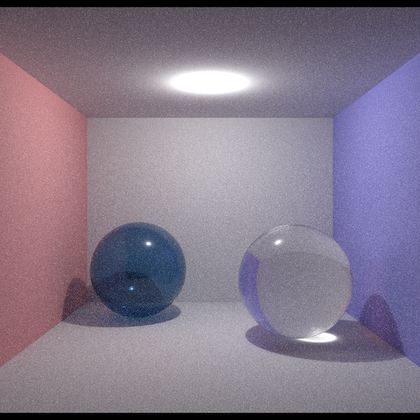
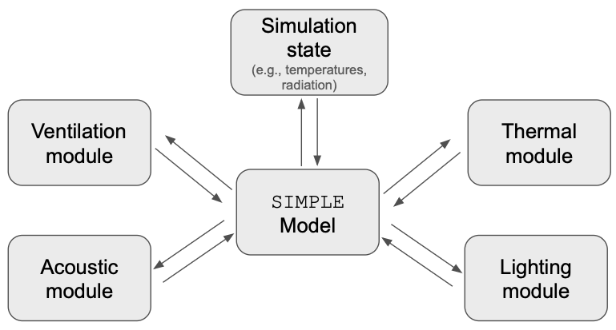
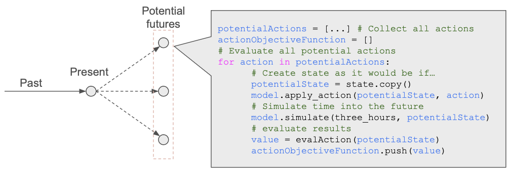
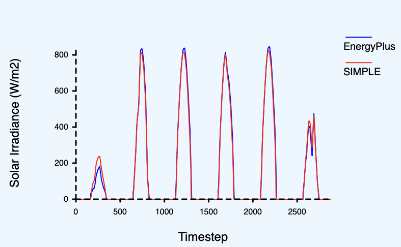

# What is `SIMPLE`?

First and foremost, `SIMPLE` is a building performance simulation tool that aims to satisfy 
the present needs of this industry.

Digging deeper, `SIMPLE` can be seen from two perspectives. 

1. **Historical** perspective, referring to the motivations and drivers that determined 
its design and motivated me to develop it. 
2. **Pragmatic** perspective, associated with those cool features and benefits of `SIMPLE` 
that I have been finding _during_ it's development. 

> Arguibly, these _pragmatic_ benefits might be present in any modern simulation tool... but considering
the low number of these, I guess they are pretty unique to `SIMPLE` anyway.

## `SIMPLE`'s origins — It's the people, stupid

The development of `SIMPLE` was motivated by the results of my [PhD Research](https://openaccess.wgtn.ac.nz/articles/thesis/Exploring_modelling_and_simulating_the_Feeling_of_Comfort_in_residential_settings/17085467/1).
In these studies, I investigated what is it that _people_—not building scientists
or architects or engineers—mean by and expect from _a comfortable home_. In a single sentence, my finidings
suggest that our understanding of building physics far outpaces our knowledge of how people 
interact with buildings. This gap is only going to widen unless we invest resources in understanding
humans.

Let put it this way:

1. **Materials have been/will be getting better** which means that, for instance, closed doors and windows are really good at 
preventing air leakage and heat transfer. Therefore, building controls and human behaviour—which define whether a window or 
door is open or closed—greatly impact the building's performance, and the health and comfort of the people in it.
2. **Software have been/will be getting better**, meaning that we can—for instance—predict and understand the effects of an open/closed window better than ever before
3. **Our understanding of people is not catching up**, meaning that we are not certain of whether windows and doors are open or not.

> **Note that** point 3 is not suggesting that nothing has been done about understanding people. However,
> I would argue that our current tools to study people are not the best. This should be more clear later in this section.

This is a problem because buildings are built for people. Therefore, not understanding people implies not understanding the performance of buildings. Understanding _when_ and _why_ people choose to open
windows requires tools that will let us properly research and evaluate human comfort
and behaviour.

Below are the three main elements of `SIMPLE` that make it better at simulating buildings
for real people.

### 1. It was designed to allow for holistic simulations

The motivation for performing holistic simulations is kind of obvious: when people get into a room, they just
_feel_ it. In other words, **people do not separate—as software and building scientists do—the
Thermal from the Daylight from the Acoustic domains**. This means that,
if we want to trully incorporate people's behaviour and comfort into our simulations, we need to account
for multiple domains at the same time, **at run time**.

> **At run time means** that it is not enough to run three simulations (one for thermal, one for acoustic, one for
> lighting) without considering the interaction between these domains.

So far, `SIMPLE` is actually quite good at Lighting and Thermal simulation, even though this feature has not been
fully utilised. For instance, the following figure is evidence of how good it can calculate lighting
and how well it compares to [Energy Plus](https://energyplus.net) in therms of temperature estimations.

| Lighting simulation | Thermal simulation |
|-|-|
|  | |


In order to allow for holistic simulations, we developed an architecture where different modules would connect to a single—domain agnostic—api. This API is the `SIMPLE Model`, and it allows any developer to say _"Hey, give me the temperature of this room"_ without knowing _how_ this value was calculated. In a similar manner, it allows these developers to make available values for other modules to use.



### 2. It was designed to give some room for people's lives

People are not simple. They do not just say _"it is cold, I will turn the heater on"_
in a deterministic manner. They take into account things like budget, bills, whether
they are alone, and whether they have kids. Modelling this kind of
behaviour calls for a much more flexible way of modelling control algorithms (yes, I am
treating human behaviour as a control algorithm).

This is actually addressed in the same way as point 1 (i.e., Holistic simulations), in 
the sense that a new module could be created to deal with "Budget" or "Safety" and then
use the same API to read and write values.

### 3. It was designed to travel in time

`SIMPLE` was designed with the purpose of acknowledging that **people are constantly aware of their future**.
This is kind of obvious (e.g., you put a jacket _before_ going out, not after) but our simulation tools tend
to make it hard to implement this feature. 

Allowing the simulation to travel in time is not trivial, as it means that—at every time step of the simulation—we
need to estimate what will happen in the future and then return to the present.

From a simulation perspective, this implies

1. Gathering a bunch of potential actions to take
2. Execute each action, simulating some time into the future, record the results, and undo the changes.
3. From the results of all actions, identify the best decision to take, if any.



`SIMPLE` deals with this challenge by separating the `Simulation State` (i.e., the values that 
describe the physical state of the building and therefore change during the simulation) from the model (i.e., which
is constant throughout the simulation). From a software perspective, the structure representing 
the model is _immutable_ while the state is _mutable_.

The whole point of this architecture is that the `Simulation State` happens to be 
a relatively small and cheap-to-copy structure (it is an array of floating point numbers).
This implies that **during a simulation**, we can create copy, then simulate, and then
destroy this copy without much loss of performance.

## Beyond people — benefits of a modern tool

Having a modern simulation tool offers several benefits. However, it is important to also acknowledge the 
general benefits that come built-in from designing a tool that helps design buildings for people:


1. **Holistic simulations** let us optimize multi-domain control algorithms that might lead to more
   optimal performance of buildings.
2. **Traveling in time** gives us the chance to implement Model Predictive Control, at runtime, in production,
   as part of a real EMS system.

And, of course, there are other benefits.

### 1. It allows easily defining complex control algorithms

`SIMPLE` can ingest control algorithms as scripts. This allows for a much richer and flexible
way of writing algoritghms than through schedules. or other common methods.

```rs
let kids_bedroom = space("Kids Bedroom");
let kids_heater = hvac("Kids heater");
let kids_window = fenestration("kids window");

let window_is_open = kids_window.open_fraction > 0.0
let temperature = kids_bedroom.dry_bulb_temperature;
let is_cold = temperature < 19
let is_hot = temperature > 25

let outside_temperature = kids_window.front_temperature

if is_hot && outside_temperature < inside_temperature  {
    if random() < 0.7 {
        // 70% chance of opening windows
        kids_window.open_fraction = 1
    }
} else if is_cold && outside_temperature > inside_temperature {
    if random() < 0.3 {
        // 30% chance of ventilating
        kids_window.open_fraction = 1
    }
} else {
    if random() < 0.5{
        // 50% of opening windows to balance temperatures
        kids_window.open_fraction = 1
    }
}


// Do something else...

```

### 2. You can store and reuse the solar calculations

Optical calculations—like those required for estimating the amount of sun or light that reaches each 
surface—can be computationally expensive. Because of this, it is common to pre-calculate as much 
as possible _before_ the simulation starts, and then reuse this data when advancing through time.


`SIMPLE` goes one step ahead and allows you to save this data, and then reuse it in succeding 
simulations. (This data is valid as long as the geometry and materials of the model remain the same.)

```rs
SolarOptions {
    optical_data_path: "./path/to/solar/data.json",
    // ... other options
}
```

Some applications of this are the following:

1. We had `SIMPLE` deployed on the cloud, and used it to run simulations on-demand. Keeping the solar 
data on a database meant that we did not have to recalculate it, significantly reducing response time
and computational expenses.
2. Optimising non-geometric elements (e.g., insulation thickness, size of heaters, luminaire placements, etc.)
does not imply changes in geometry. This means that every step of the optimisation will be shorter.

> **Note:** A very common example of this technique is the Daylight Coefficients, which is the method that 
`SIMPLE` utilises to calculate the amount of solar radiation reaching each surface. The figure
below shows how `SIMPLE`'s results compare to those of EnergyPlus, which performs this calculation in
a very different manner.
> 


### 3. You can save the current state of the simulation

> _This is possible, but not yet implemented_

Given that the `Simulation State` is a relatively small, independent object, 
it can be conveniently stored in a database or text file. This enables the 
pausing and restarting of simulations, offering flexibility for various applications.

This feature can potentially be particularly beneficial for integrating `SIMPLE` with 
Energy Management Systems (EMS). By periodically running simulations, 
EMS systems can update the building's current state and determine the most o
ptimal control strategy, such as Model Predictive Control.

### 4. Deploy it to modern infrastructure

`SIMPLE` is a modern tool, written in a modern language, and that can run in
multiple environments.

| Environment | Example | 
| ------------|---------|
| **Run locally** | Being a pure `RUST` program, can be compiled to run on Windows, Linux and MacOS (has been tested on Linux and Mac).|
| **Web Assembly** | Run it on a browser, without the need for servers. [CHECK THIS EXAMPLE](http://buildingsforpeople.org/simple_demo/) |
| **On the cloud** | Embed `SIMPLE` into a web server and release it into [very small and secure containers](https://github.com/GoogleContainerTools/distroless) | 
| **On location** | (_not tested_) Compile `SIMPLE` in a Raspberry PI or similar machine, and put it to work as part of the EMS | 

