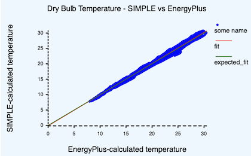

# What is `SIMPLE`?

I think `SIMPLE` can be seen from two perspectives. One of them is **historical**, and refers
to the motivations and drivers that determined its design and motivated me to develop it. And the other one is
**pragmatic**, refering to those cool features and benefits of `SIMPLE` that I have been finding _during_ it's
development. (Arguibly, these pragmatic benefits might be present in any modern simulation tool... but considering
the low number of these, I guess they are pretty unique to `SIMPLE` anyway.)

## `SIMPLE`'s historical origins: It's the people, stupid

The development of `SIMPLE` was motivated by the results of my [PhD Research](https://openaccess.wgtn.ac.nz/articles/thesis/Exploring_modelling_and_simulating_the_Feeling_of_Comfort_in_residential_settings/17085467/1).
In these studies, I investigated what is it that people—not building scientists
or architects or engineers—mean by and expect from _a comfortable home_. My finidings
revealed to me how imbalanced our knowledge is, and how this disparity will continue to grow in the future
if we do not dedicate more time to humans. Let me put it as follows:

1. **Materials have been/will be getting better**: e.g., Whether a window is open or closed makes a big different
   to the building's performance, and the health and comfort of the people in it.
2. **Software have been/will be getting better**: e.g., We can predict and understand the effects of an open/closed window better than ever before
3. **Our understanding of people is not catching up**: e.g., do we _really_ know whether the window open or closed?

> **PLEASE Note**: Point 3 is not meant to say that nothing has been done about understanding people. However,
> I would argue that our current tools to study people are not the best. This should be more clear later in this section.

This is a problem because buildings are built for people. Therefore, not understanding people implies not understanding the performance of buildings. Understanding _when_ and _why_ people choose to open
windows requires tools that will let us properly research and evaluate human comfort
and behaviour.

Below are the three main elements of `SIMPLE` that make it better at simulating buildings
for real people.

### 1. It was designed to allow for holistic simulations

The motivation for performing holistic simulations is kind of obvious: when people get into a room, they just
_feel_ it. In other words, **people do not separate—as software and building scientists do—the
Thermal from the Daylight from the Acoustic domains**. This means that,
if we want to trully incorporate people's behaviour and comfort into our simulations, we need to account
for multiple domains at the same time, **at run time**.

So far, `SIMPLE` is actually quite good at Lighting and Thermal simulation, even though not all the juice has 
been extracted from it. For instance, the following images are evidence of how good it can calculate lighting
and how well it compares to [Energy Plus](https://energyplus.net) in thermal calculations.

| Lighting image | Comparison between `SIMPLE` and Energy Plus |
|-|-|
|  | |

> **At run time means** that it is not enough to run three simulations (one for thermal, one for acoustic, one for
> lighting) without considering the interaction between these domains.

In order to allow for holistic simulations, we developed an architecture where different modules would connect to a single—domain agnostic—api. This API is the `SIMPLE Model`, and it allows any developer to say _"Hey, give me the temperature of this room"_ without knowing _how_ this value was calculated. In a similar manner, it allows these developers to make available values for other modules to use.


### 2. It was designed to give some room for people's lives

People are not simple. They do not just say _"it is cold, I will turn the heater on"_
in a deterministic manner. They take into account things like budget, bills, whether
they are alone, and whether they have kids. Modelling this kind of
behaviour calls for a much more flexible way of modelling control algorithms (yes, I am
treating human behaviour as a control algorithm).

This is actually addressed in the same way as point 1 (i.e., Holistic simulations), in the sense that a new module could be created to deal with "Budget" or "Safety" and then use the same API to read and write values.

### 3. It was designed to travel in time

`SIMPLE` was designed with the purpose of acknowledging that **people are constantly aware of their future**.
This is kind of obvious (e.g., you put a jacket _before_ going out, not after) but our simulation tools tend
not to do this at all. This is also not trivial to implement, as it means that people—every time they need to decide what to do—consider the near future that is comming.

From a simulation perspective, this implies

1. gathering a bunch of potential actions to take
2. mentally implementing that change and simulating some time into the future
3. identify the best decision to take, if anygit.


The way `SIMPLE` deal with this is by separating the `Simulation State` (i.e., the values that are part of state of the simulation and _NOT_ temporary) from the model. From a software perspective, the structure representing the model is _immutable_, and thererfore the simulation process implies changing a _mutable_ element we call the state.

This makes it much easier and computationally cheaper to, **during a simulation**, copy, simulate, and decide which is the best option to take.

## The benefits of a modern tool: Going beyond people

Having a modern simulation tool offers several benefits. However, it is important to also acknowledge the 
general benefits that come built-in from designing a tool that helps design buildings for people:


1. **Holistic simulations** let us optimize multi-domain control algorithms that might lead to more
   optimal performance of buildings.
2. **Traveling in time** allows us to implement Model Predictive Control, at runtime, in production,
   as part of a real EMS system.

And, of course, there are other benefits.

### 1. It allows easily defining complex control algorithms

`SIMPLE` allows writing control algorithms as scripts. This allows for a much richer and flexible
way of writing algoritghms than through schedules. or other common methods.

```rs
let kids_bedroom = space("Kids Bedroom");
let kids_heater = hvac("Kids heater");
let kids_window = fenestration("kids window");

let window_is_open = kids_window.open_fraction > 0.0
let temperature = kids_bedroom.dry_bulb_temperature;
let is_cold = temperature < 19
let is_hot = temperature > 25

let outside_temperature = kids_window.front_temperature

if is_cold {
    if outside_temperature < inside_temperature  {
        if random() < 0.7 {
            // 70% chance of opening windows
            kids_window.open_fraction = 1
        }
    } else if outside_temperature > inside_temperature {
        if random() < 0.3 {
            // 30% chance of ventilating
            kids_window.open_fraction = 1
        }
    } else {
        if random() < 0.5{
            // 50% of opening windows to balance temperatures
            kids_window.open_fraction = 1
        }
    }
}

// Do something with heaters.

```

### 2. Programs no longer just run on your PC

`SIMPLE` is a modern tool, written in a modern language, and that can run in
multiple environments.

| Environment | Example | 
| ------------|---------|
| **Run locally** | Being a pure `RUST` program, can be compiled to run on Windows, Linux and MacOS (has been tested on Linux and Mc).|
| **Web Assembly** | Run it on a browser, without the need for servers. [CHECK THIS EXAMPLE](http://buildingsforpeople.org/simple_demo/) |
| **On the cloud** | Embed `SIMPLE` into a web server and release it into [very small and secure containers](https://github.com/GoogleContainerTools/distroless) | 
| **On location** | (_not tested_) Compile `SIMPLE` in a Raspberry PI or similar machine, and put it to work as part of the EMS | 

